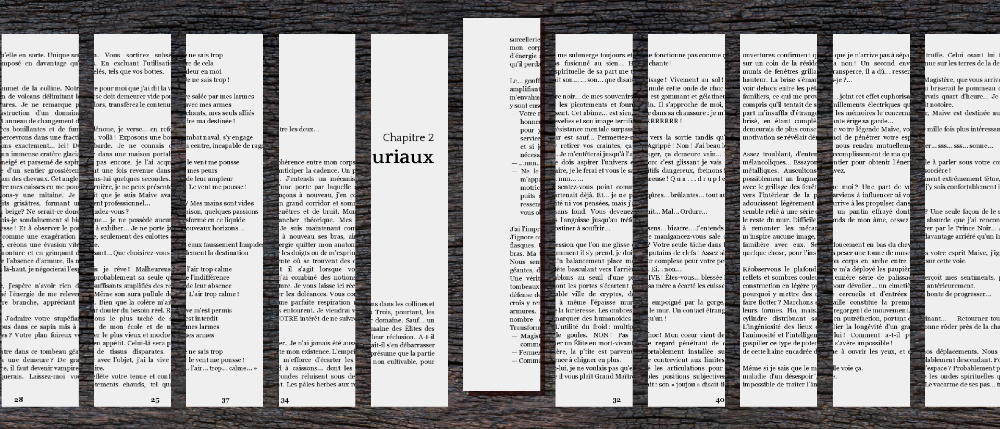
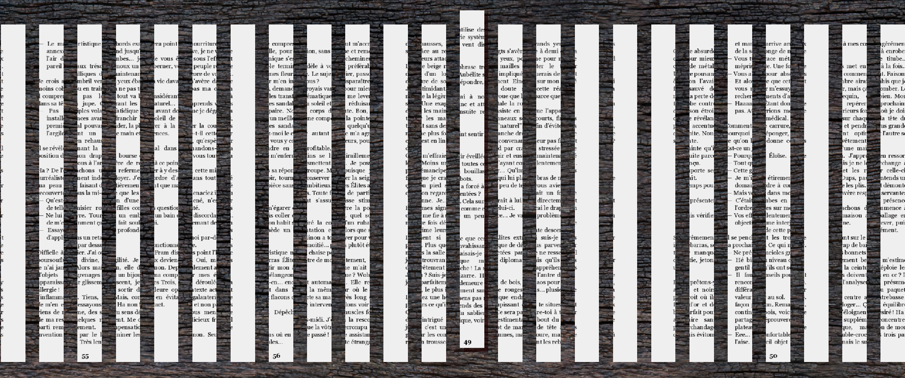
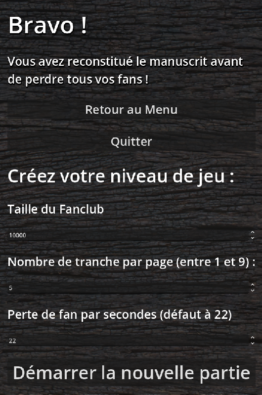

# Titre&thinsp;: *Autoédition*

*par Marie-Eve Bouchard*

---

## Scénario

Vous êtes persuadé·e avoir pondu le meilleur roman de votre longue carrière.  
Pourtant, votre éditeur réagit mal. Est-ce la jalousie, le dégoût ou autre chose qui le pousse, devant vos yeux horrifiés, à saisir votre manuscrit — ainsi que votre contrat d’édition — pour les balancer ensemble dans la déchiqueteuse&thinsp;?

Votre cœur chavire&thinsp;: comme vous aviez toute confiance en lui depuis tant d'années de collaboration, vous lui aviez fourni votre seule copie&thinsp;!

**Objectif**

> Reconstruire le manuscrit, une languette à la fois, pour l'autopublier avant que le fanclub se vide.

---

## **Concepts de programmation utilisés**

##### 

##### Pooling

Créer entre 20 et plus de 300 tranches de manuscrit sur la scène principale n'était pas optimal, j'ai donc pensé à un système non destructif pour recycler des objets utilisés pour afficher seulement les tranches proche du "joueur". 

Par contre, j'ai profité d'une itération du projet pour afficher toutes les bandes physiques et logique sur la table de jeu pour m'assurer de l'intégrité des données lors des déplacements des bandes par le joueur, ensuite je suis passé au développement du pool en toute tranquilité.

**Dimension physique vs logique des éléments du pool**

Les éléments du jeu débodent à peine de l'écran afin de laisser une certaine marge de manoeuvre et plutôt que de créer et détruire des éléments pour en garder un total décent, les bandes qui sont en dehors de l'écran se "téléportent" d'un côté à l'autre et se mettent à jour pour afficher le bon fragment (d'une seule image unique) selon l'ordre global du tableau d'index des tranches (sprite) du chapitre en cours de réparation. 

         

> *Plus les pages sont divisées, plus les bandes sont petites et plus le pool est grand! Sur l'image, le joueur est situé sur la tranche relevée — toujours la bande la plus proche du centre.*

Ce tableau évolue et se met à jour automatiquement au fil de la partie lorsque le joueur déplace des éléments du pool physique.

Le nombre d'objets dans le pooling n'est pas déterminé à l'avance, car il est dépendant du nombre de tranche par page envoyé en paramètre à ma classe de construction du chapitre, par soucis de respecter les contraintes de temps, ces données sont stoquées dans le même script de paramètres globaux que la musique.

Pour créer cet algorythme, J'ai réalisé que je devais générer la presque totalité des éléments du jeu par code, alors j'ai simplement écrit plusieurs version d'une mécanique mixte de génération/pooling en algo et pseudocode, pour à chaque réécriture en simplifier les mécaniques jusqu'à ce que ce soit programmable. 

J'ai aussi testé mes algos et pseudo-code par chat gpt. Ces derniers n'ont jamais été assez "simple" pour qu'il puisse comprendre ce que ça faisait, mais ça m'a permis de voir ce qui "accrochait" dans ma logique pour éviter des bugs (puisque lui-même est un ordinateur).

##### Génération automatique

Afin de réussir le pooling et la personalisation du niveau 2, je n'avais d'autre choix que de développer une logique de création de tranches automatisée, car, souvenons-nous : la taille du pool dépend de la taille des éléments, qui lui dépends de la quantité de divisions (de tranches) par page. 

Donc, lorsque l'on appuis sur jouer, les paramètres sont envoyés à un classe qui clacul la taille des bandes selon la taille de l'image fournie et le nombre de tranches. Ensuite, il repère le côté gauche de l'écran pour créer la première bande, se décale selon la marge fournie et continue de créer des bandes jusqu'au moment ou une bande dépasse l'écran. À cet instant il active un compteur de 6 bandes supplémentaires pour créer un buffer. Je déplace ensuite le joueur au centre du pool et la partie commence. 

J'ai testé que ma logique de création ne créait pas plus de bande que voulu en n'ajoutant pas tout de suite la logique de recyclage, ainsi, je me promenais dans la page et pouvait compter le nombre de bandes créé.

J'ai aussi utilisé cette technique de micro-itération sur toute ma programation et je réglais tout bug avant de passer à la suite.

Ma recherche à ce sujet c'est donc principalement faite par essaie et erreur : au début j'essayais de créer le pool à partir du centre et vers les 2 côtés. J'ai aussi essayé de calculer le nombre de bandes requises en avance, c'était compliqué pour rien et pleins de risques de bugs. Cette version demande très peu de calculs en comparaison finale !

##### Niveau personalisé

Le résultat combiné ci-haut visait entre autre à permettre la personalisation d'un niveau en guise de "récompense" d'avoir réussit le premier niveau. Ainsi, le joueur peut choisir le nombre de tranche par page, le nombre de membre du fanclub au départ et le nombre de fan perdu par seconde.

De plus, dans le menu il est aussi possible d'activer ou désactiver un son aidant le joueur à détecter des bandes consécutives. Cette mécanique à aussi demandé le développement d'un algorythme personalisé, ainsi que l'utilisation de 4 bus audio, le master (pour gérer le mute global) et ses enfants :

- la musique

- le son d'actions

- le son d'aide

##### Débuguage console

Puisque tous mes éléments physiques étaient créé par code, au moment ou j'ai eu de grand soucis, j'ai créé un système de debug console adapté aux tests dont j'avais besoin.

---

##### Aide intégré

Le joueur peut consulter automatiquement l'aide intégré lorsqu'il met en pause le jeu. Il y a aussi les informations dans le menu de départ.
